<p align="center">
  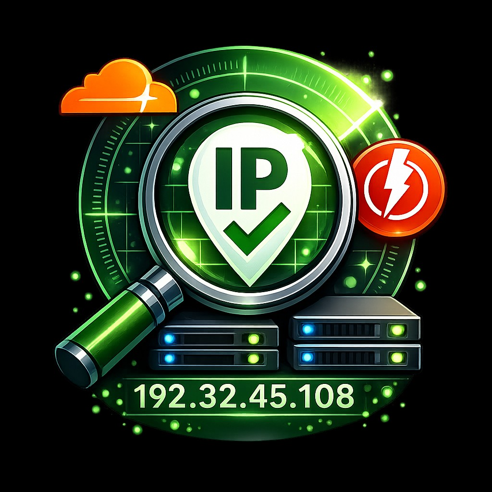
</p>

<h1 align="center">CDN IP Scanner نسخه ۳.۰</h1>

<p align="center">
  <b>دقت بالا &bull; سرعت فوق‌العاده &bull; نتایج لحظه‌ای</b>
</p>

<p align="center">
  <a href="https://www.npmjs.com/package/cdn-ip-scanner"></a>
  <a href="https://github.com/shahinst/cdn-ip-scanner/releases"></a>
  <a href="https://github.com/shahinst/cdn-ip-scanner/stargazers"></a>
  <a href="https://github.com/shahinst/cdn-ip-scanner/blob/main/LICENSE"></a>
  <a href="https://github.com/shahinst/cdn-ip-scanner/releases"></a>
</p>

<p align="center">
  🌐 <b>زبان:</b> <a href="README.md">English</a> &nbsp;|&nbsp; <b>فارسی</b>
</p>

<p align="center">
  <a href="#-نصب">نصب</a> &bull;
  <a href="#-ویژگیها">ویژگی‌ها</a> &bull;
  <a href="#-راهنمای-استفاده">راهنمای استفاده</a> &bull;
  <a href="#-تغییرات-نسخه-۳۰">تغییرات نسخه ۳.۰</a> &bull;
  <a href="#-برای-توسعهدهندگان">توسعه‌دهندگان</a> &bull;
  <a href="#-حمایت-مالی">حمایت مالی</a>
</p>

---

<p align="center">
  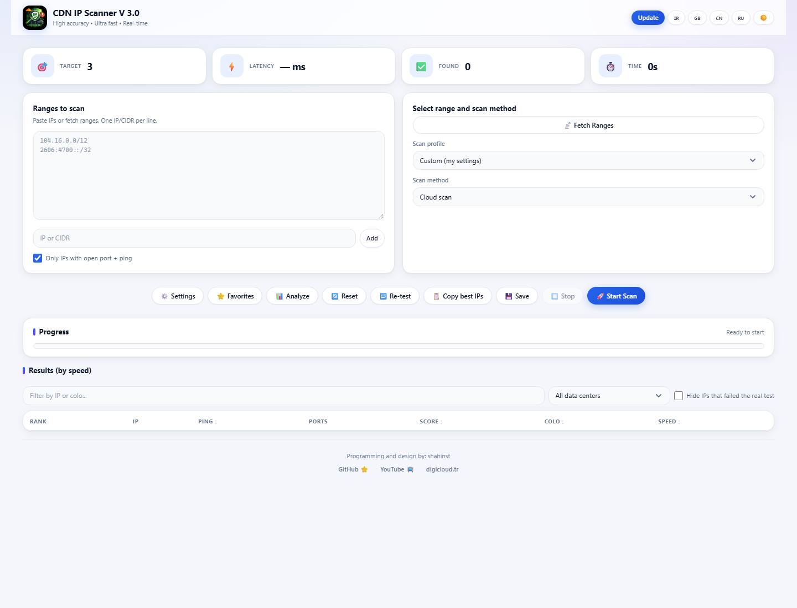
</p>
<p align="center">
  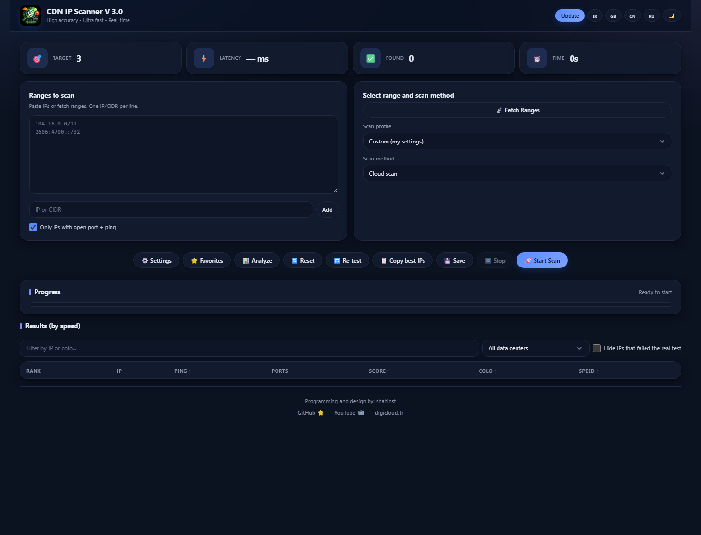
</p>

---

<div dir="rtl">

## 📚 فهرست مطالب

1. [معرفی](#-معرفی)
2. [ویژگی‌ها](#-ویژگیها)
3. [نصب](#-نصب)
   - [اپ npm (ویندوز / مک / لینوکس) — قدم به قدم](#-اپ-npm-ویندوز--مک--لینوکس)
   - [اپ اندروید](#-اپ-اندروید)
   - [سرور لینوکس](#-سرور-لینوکس)
   - [فایل‌های ریلیز و پیش‌نیازها](#-فایلهای-ریلیز-و-پیشنیازها)
4. [راهنمای استفاده](#-راهنمای-استفاده)
5. [دموی اپ اندروید](#-دموی-اپ-اندروید)
6. [برای توسعه‌دهندگان](#-برای-توسعهدهندگان)
7. [تغییرات نسخه ۳.۰](#-تغییرات-نسخه-۳۰)
8. [آموزش تصویری](#-آموزش-تصویری)
9. [مشارکت](#-مشارکت)
10. [حمایت مالی](#-حمایت-مالی) · [مجوز](#-مجوز) · [نویسنده](#-نویسنده)

---

## 🔎 معرفی

**CDN IP Scanner** سریع‌ترین و تمیزترین آی‌پی‌های لبه **Cloudflare**، **Fastly** و سایر CDNها را برای شبکه شما پیدا می‌کند. یک رنج بدهید (یا بگذارید برنامه رنج‌های رسمی را بگیرد)، *شروع* را بزنید و آی‌پی‌های تأییدشده را به‌صورت زنده با پینگ، پورت‌های باز، دیتاسنتر و امتیاز ۰ تا ۱۰۰ ببینید. یک کانفیگ V2Ray بدهید تا آی‌پی‌هایی را پیدا کند که واقعاً برای *همان کانفیگ* ترافیک رد می‌کنند و بعد لینک ساب‌اسکریپشن، QR یا فایل آماده Clash / sing-box تحویل بگیرید.

هر آی‌پی از یک پیش‌چک TCP و **تأیید ۵ مرحله‌ای `/cdn-cgi/trace`** می‌گذرد (حداقل ۳ پاسخ واقعی از لبه CDN لازم است)؛ بنابراین لیست فقط آی‌پی‌هایی را دارد که واقعاً جواب می‌دهند، نه هر میزبانی که یک پورت باز دارد.

### سه روش اجرا

| | روش | مناسب برای |
|---|---|---|
| 🟢 **اپ npm** (جدید در ۳.۰) | `npm install -g cdn-ip-scanner` و سپس `cdn-ip-scanner --port 8080` | ویندوز، مک و لینوکس — یک دستور، بدون پایتون، بدون نصب‌کننده |
| 📱 **اپ اندروید** | نصب APK از صفحه Releases | اسکن مستقیم روی گوشی، حتی با اینترنت موبایل |
| 🐧 **سرور لینوکس** | `sudo bash install.sh` | پنل همیشه‌روشن و اشتراکی پشت nginx با TLS و رمز ورود |

هر سه نسخه امکانات، رابط کاربری و امتیازدهی یکسانی دارند.

### روند کار

</div>

```
۱. دریافت رنج‌های CDN (یا وارد کردن رنج دلخواه)
۲. انتخاب روش اسکن (کلود / اپراتور / V2Ray)
۳. انتخاب پروفایل یا تنظیم تعداد هدف، بازه پینگ و پورت‌ها
۴. زدن «شروع اسکن» و مشاهده نتایج به‌صورت زنده
۵. تست مجدد، فیلتر و ستاره‌دار کردن آی‌پی‌های خوب
۶. خروجی گرفتن، کپی بهترین آی‌پی‌ها یا دانلود فایل Clash / sing-box
```

<div dir="rtl">

### روش‌های اسکن

- **اسکن کلود** — اسکن مستقیم آی‌پی‌های CDN با پیش‌فیلتر TCP و تأیید ۵ مرحله‌ای HTTP
- **اسکن اپراتور** — پیدا کردن آی‌پی‌های CDN که روی یک اپراتور خاص کار می‌کنند (اسکن از شبکه همان دستگاه انجام می‌شود؛ پس روی شبکه همان اپراتور اجرا کنید)
- **اسکن V2Ray** — کانفیگ V2Ray بدهید تا آی‌پی‌های سالم برای آن پیدا شود؛ تست واقعی Xray اختیاری است

---

## ✨ ویژگی‌ها

| ویژگی | توضیح |
|-------|-------|
| **اجرا با یک دستور** | `npx cdn-ip-scanner` یا `npm i -g cdn-ip-scanner` — رابط وب روی پورت دلخواه (پیش‌فرض ۸۰۸۰) بالا می‌آید |
| **رابط کاربری مدرن** | قالب جدید داشبوردی با حالت روشن و تاریک، واکنش‌گرا از موبایل تا نمایشگر عریض، راست‌چین برای فارسی |
| **دریافت رنج از چندین منبع** | API کلودفلر، ASN، لیست‌های گیت‌هاب، لیست تأییدشده فستلی، یا رنج دستی خودتان |
| **تأیید ۵ مرحله‌ای** | هر آی‌پی ۵ بار با استفاده مجدد از اتصال تست می‌شود — حداقل ۳ پاسخ واقعی لازم است |
| **نتایج لحظه‌ای** | نمایش فوری نتایج از طریق WebSocket همراه با نمودار زنده سرعت اسکن و پینگ |
| **امتیازدهی** | امتیاز ۰ تا ۱۰۰ بر اساس پینگ، پورت‌های باز، سرعت دانلود و تست واقعی کانفیگ؛ آی‌پی‌های مرده صفر می‌شوند |
| **۴ حالت سرعت و پروفایل** | Hyper / Turbo / Ultra / Deep برای کنترل مصرف منابع؛ پروفایل‌های یک‌کلیکی سریع، متعادل، کامل و اینترنت موبایل |
| **نمونه‌برداری منصفانه** | انتخاب چرخشی از بلوک‌های /24 تا همه رنج‌ها دیده شوند؛ IPv4 و IPv6 |
| **پشتیبانی کانفیگ V2Ray** | پارس vless://، vmess://، trojan://؛ تست آی‌پی‌ها با SNI/Host همان کانفیگ و بازسازی کانفیگ برای هر آی‌پی سالم |
| **تست واقعی با Xray** | بهترین آی‌پی‌ها از داخل Xray-core با کانفیگ خودتان تست می‌شوند — فقط آی‌پی‌هایی که واقعاً ترافیک رد می‌کنند قبول می‌شوند |
| **تست سرعت دانلود** | تست دانلود واقعی از طریق بهترین آی‌پی‌ها؛ سرعت در امتیاز لحاظ می‌شود |
| **ساب‌اسکریپشن، QR، Clash و sing-box** | لینک ساب‌اسکریپشن برای v2rayN / v2rayNG / Hiddify، کپی همه کانفیگ‌ها، QR برای هر آی‌پی و فایل آماده Clash/Mihomo یا sing-box با انتخاب خودکار سریع‌ترین آی‌پی |
| **برچسب اپراتور** | برچسب‌گذاری نتایج با اپراتور ایرانی (ایرانسل، همراه اول، رایتل، شاتل)، چینی یا روسی — تست از شبکه همان دستگاه انجام می‌شود |
| **نام دیتاسنترها** | کد colo همراه با نام شهر (FRA ← فرانکفورت، آلمان) در جدول، فیلتر و همه خروجی‌ها |
| **فیلتر و مرتب‌سازی** | فیلتر بر اساس IP یا دیتاسنتر، پنهان کردن تست‌های ناموفق، مرتب‌سازی با پینگ، امتیاز، سرعت یا تأخیر واقعی |
| **تست مجدد و کپی بهترین‌ها** | بررسی دوباره همه آی‌پی‌های یک اسکن با یک کلیک (مرده‌ها علامت می‌خورند) و کپی ۱۰ آی‌پی برتر |
| **علاقه‌مندی‌ها و پایش** | ذخیره آی‌پی با ☆، بررسی خودکار (۵ دقیقه تا ۳ ساعت)، آپ‌تایم ۲۴ ساعته و پیام تلگرام وقتی یکی از کار افتاد |
| **خلاصه اسکن در تلگرام** | دریافت بهترین آی‌پی‌های هر اسکن در تلگرام (با پشتیبانی پروکسی) |
| **ادامه اسکن** | اسکن متوقف‌شده یا نیمه‌کاره را با یک کلیک از همان‌جا ادامه دهید |
| **خروجی** | JSON، اکسل (xlsx.)، CSV با هدر چهارزبانه یا متن ساده (فقط آی‌پی) |
| **تاریخچه و لاگ** | نگهداری همه جلسات با پارامترها؛ لاگ زنده با حالت DEBUG |
| **گزارش عیب‌یابی** | گزارش یک‌کلیکی (نسخه، سیستم، تنظیمات بدون اطلاعات محرمانه، لاگ) برای پیوست به گزارش باگ |
| **چندزبانه** | انگلیسی، فارسی، چینی، روسی |
| **به‌روزرسانی خودکار** | بررسی نسخه جدید داخل برنامه؛ اپ npm با `npm install -g cdn-ip-scanner@latest` خودش را به‌روز می‌کند |
| **توقف در هر لحظه** | دکمه توقف در کمتر از ۲ ثانیه اسکن را متوقف می‌کند |

---

## 📥 نصب

### 🟢 اپ npm (ویندوز / مک / لینوکس)

روش پیشنهادی برای کامپیوتر و لپ‌تاپ. حدود دو دقیقه زمان می‌برد.

#### قدم ۱ — نصب Node.js (فقط یک بار)

نسخه **LTS** را از **[nodejs.org/en/download](https://nodejs.org/en/download)** دانلود و نصب کنید (در لینوکس می‌توانید از پکیج‌منیجر یا `nvm` هم استفاده کنید). Node.js نسخه ۱۸ یا بالاتر لازم است؛ npm همراه آن نصب می‌شود.

</div>

<p align="center">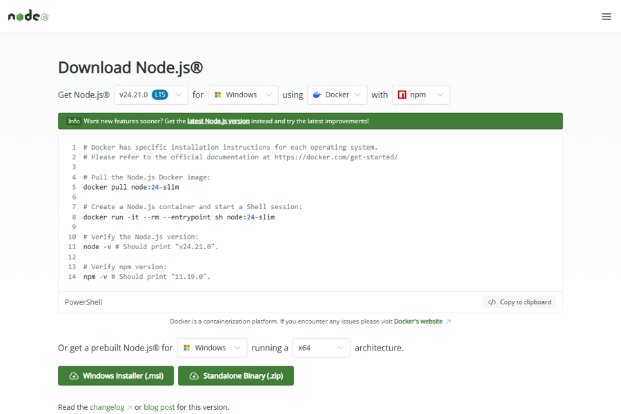</p>

<div dir="rtl">

یک ترمینال باز کنید (ویندوز: *Terminal* / *PowerShell* / *CMD*؛ مک: *Terminal*؛ لینوکس: هر شِلی) و مطمئن شوید:

</div>

```bash
node --version      # باید v18 یا بالاتر باشد
```

<div dir="rtl">

#### قدم ۲ — نصب CDN IP Scanner

</div>

```bash
npm install -g cdn-ip-scanner
```

<p align="center">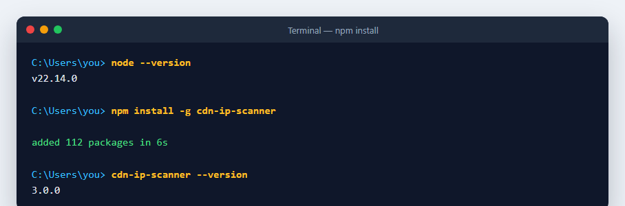</p>

<div dir="rtl">

> در لینوکس/مک اگر `npm install -g` خطای دسترسی داد، یا از `nvm` استفاده کنید یا دستور را با `sudo` اجرا کنید.
> آفلاین هستید؟ فایل `CDN-IP-Scanner-<version>-npm.tgz` را از Releases بگیرید و `npm install -g ./CDN-IP-Scanner-<version>-npm.tgz` را اجرا کنید.

#### قدم ۳ — اجرا روی یک پورت

</div>

```bash
cdn-ip-scanner --port 8080 --open
```

<p align="center">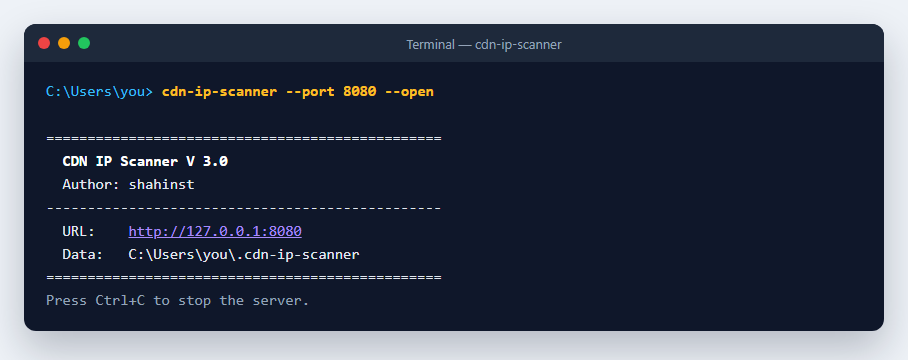</p>

<div dir="rtl">

سرور آدرس و پوشه داده را چاپ می‌کند. گزینه `--open` مرورگر را خودکار باز می‌کند؛ در غیر این صورت خودتان **http://127.0.0.1:8080** را باز کنید. تا وقتی از برنامه استفاده می‌کنید پنجره ترمینال را باز نگه دارید و برای توقف `Ctrl+C` بزنید.

</div>

<p align="center">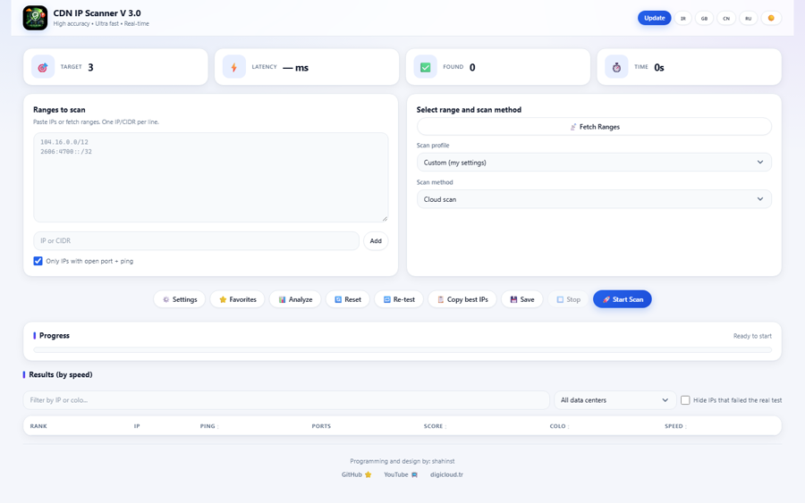</p>

<div dir="rtl">

#### قدم ۴ — گزینه‌ها، به‌روزرسانی و حذف

</div>

```bash
cdn-ip-scanner --port 9090                       # هر پورت آزاد
cdn-ip-scanner --host 0.0.0.0 --username me --password secret   # دسترسی از دستگاه‌های دیگر، با رمز
cdn-ip-scanner --data-dir D:\scanner-data         # ذخیره داده‌ها در جای دیگر
npx cdn-ip-scanner --port 8080                   # اجرا بدون نصب
npm install -g cdn-ip-scanner@latest             # به‌روزرسانی (دکمه Update داخل برنامه همین کار را می‌کند)
npm uninstall -g cdn-ip-scanner                  # حذف
```

<p align="center">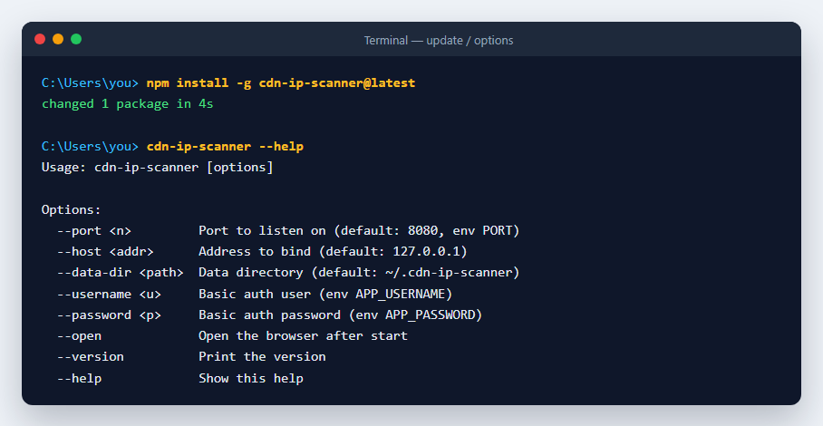</p>

<div dir="rtl">

| گزینه | پیش‌فرض | توضیح |
|------|---------|-------|
| `--port` یا `-p` | `8080` | پورتی که رابط وب روی آن بالا می‌آید |
| `--host` | `127.0.0.1` | آدرس bind؛ برای دسترسی از دستگاه‌های دیگر `0.0.0.0` بگذارید و حتماً رمز هم تعیین کنید |
| `--username` / `--password` | ندارد | محافظت از پنل با Basic Auth (متغیرهای `APP_USERNAME` / `APP_PASSWORD` هم کار می‌کنند) |
| `--data-dir` | `~/.cdn-ip-scanner` | محل ذخیره تنظیمات، جلسات، نتایج، علاقه‌مندی‌ها و لاگ |
| `--open` | خاموش | باز کردن مرورگر بعد از اجرا |
| `--version` / `--help` | | |

داده‌ها فایل JSON ساده هستند، با به‌روزرسانی از بین نمی‌روند و پشتیبان‌گیری از آن‌ها آسان است. نسخه npm **هیچ ماژول نیتیوی ندارد** و به کامپایلر نیاز ندارد.

> **چرا npm به جای exe و پکیج مک؟** یک پکیج برای همه سیستم‌عامل‌ها، به‌روزرسانی با یک دستور، حجم ۲ مگابایت به جای ۶۰ مگابایت، اجرا در کمتر از یک ثانیه و بدون هشدار SmartScreen / Gatekeeper. بیلدهای قدیمی PyInstaller از نسخه ۳.۰ حذف شده‌اند.

### 📱 اپ اندروید

فایل `CDN-IP-Scanner-<version>-android.apk` را از **[صفحه Releases](https://github.com/shahinst/cdn-ip-scanner/releases)** دانلود و نصب کنید (اجازه «منابع ناشناس»). اسکن مستقیماً روی گوشی و حتی با اینترنت موبایل انجام می‌شود. اندروید ۸ یا بالاتر.

### 🐧 سرور لینوکس

</div>

```bash
git clone https://github.com/shahinst/cdn-ip-scanner.git
cd cdn-ip-scanner
sudo bash install.sh
```

<div dir="rtl">

نصب‌کننده تعاملی سیستم‌عامل را تشخیص می‌دهد (اوبونتو، دبیان، سنت‌اواس، RHEL، راکی، آلما، فدورا)، نام کاربری و رمز پنل و دامنه یا آی‌پی را می‌پرسد، پایتون و nginx و وابستگی‌ها را نصب می‌کند، TLS را راه می‌اندازد (Let's Encrypt برای دامنه، self-signed برای آی‌پی)، سرویس systemd سخت‌شده با کاربر غیرروت `cdnscanner` می‌سازد، پورت‌های ۸۰ و ۴۴۳ را باز می‌کند و اطلاعات دسترسی را نشان می‌دهد.

</div>

```bash
systemctl status cdn-ip-scanner      # وضعیت
journalctl -u cdn-ip-scanner -f      # لاگ
systemctl restart cdn-ip-scanner     # ریستارت
sudo bash install.sh                 # به‌روزرسانی (دیتابیس حفظ می‌شود)
bash /opt/cdn-ip-scanner/uninstall.sh
```

<div dir="rtl">

### 📦 فایل‌های ریلیز و پیش‌نیازها

| فایل | توضیح |
|------|-------|
| `CDN-IP-Scanner-<version>-npm.tgz` | پکیج npm (همان نسخه npmjs.com) — برای نصب آفلاین |
| `CDN-IP-Scanner-<version>-android.apk` | اپ اندروید |
| `SHA256SUMS.txt` | چک‌سام همه فایل‌های بالا |
| `Source code (zip / tar.gz)` | سورس کامل |

| پلتفرم | پیش‌نیاز |
|--------|---------|
| **اپ npm (ویندوز / مک / لینوکس)** | Node.js نسخه ۱۸ یا بالاتر |
| **اندروید** | اندروید ۸.۰ یا بالاتر |
| **سرور لینوکس (`install.sh`)** | اوبونتو ۲۰/۲۲/۲۴، دبیان ۱۰+، سنت‌اواس ۷+، RHEL، راکی، آلما، فدورا — پایتون ۳.۱۰+ توسط اسکریپت نصب می‌شود |

---

## 🚀 راهنمای استفاده

1. **اولین اسکن.** برنامه را باز کنید، روش را روی *کلود* بگذارید، رنج‌ها را خالی بگذارید (رنج‌های داخلی کلودفلر + فستلی استفاده می‌شوند) یا *دریافت رنج‌ها* را بزنید، یک پروفایل انتخاب کنید (*سریع* برای اولین بار) و **شروع** را بزنید. آی‌پی‌های تأییدشده به‌صورت زنده با پینگ، پورت، دیتاسنتر و امتیاز نمایش داده می‌شوند.
2. **اسکن برای کانفیگ V2Ray.** روش را روی *V2Ray* بگذارید، لینک `vless://`، `vmess://` یا `trojan://` را وارد کنید و شروع کنید. برای هر آی‌پی سالم یک کانفیگ بازسازی‌شده ساخته می‌شود؛ از **ساب‌اسکریپشن** (یک لینک برای v2rayN / v2rayNG / Hiddify)، **کپی همه**، **QR** هر ردیف یا دانلود فایل **Clash** / **sing-box** استفاده کنید. برای اینکه فقط آی‌پی‌هایی که واقعاً ترافیک رد می‌کنند بمانند، *تست واقعی Xray* را در تنظیمات فعال کنید.
3. **انتخاب بهترین‌ها.** بر اساس امتیاز یا پینگ مرتب کنید، ردیف‌های ناموفق را پنهان کنید، با **تست مجدد** همه را دوباره بررسی کنید و سپس **کپی بهترین آی‌پی‌ها** یا **خروجی** (JSON / اکسل / CSV / TXT) بگیرید.
4. **زیر نظر داشتن.** با ستاره، آی‌پی را به *علاقه‌مندی‌ها* اضافه کنید؛ پایشگر آن‌ها را زمان‌بندی‌شده بررسی می‌کند، آپ‌تایم ۲۴ ساعته نشان می‌دهد و می‌تواند در تلگرام پیام بدهد. با فعال کردن *خلاصه اسکن در تلگرام* بهترین آی‌پی‌های هر اسکن را دریافت می‌کنید.
5. **ادامه اسکن.** اگر اسکنی متوقف یا قطع شد، یک نوار پیشنهاد می‌دهد از همان‌جا ادامه دهید.

---

## 📱 دموی اپ اندروید

</div>

<p align="center">
  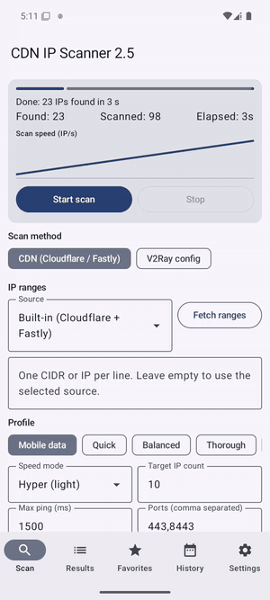
</p>

| اسکن | نتایج | علاقه‌مندی‌ها | تنظیمات |
|:---:|:---:|:---:|:---:|
| 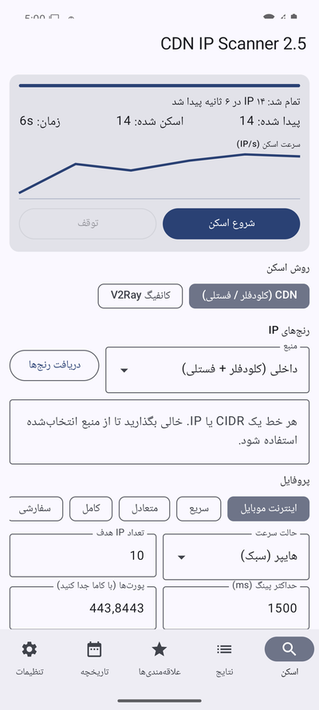 | 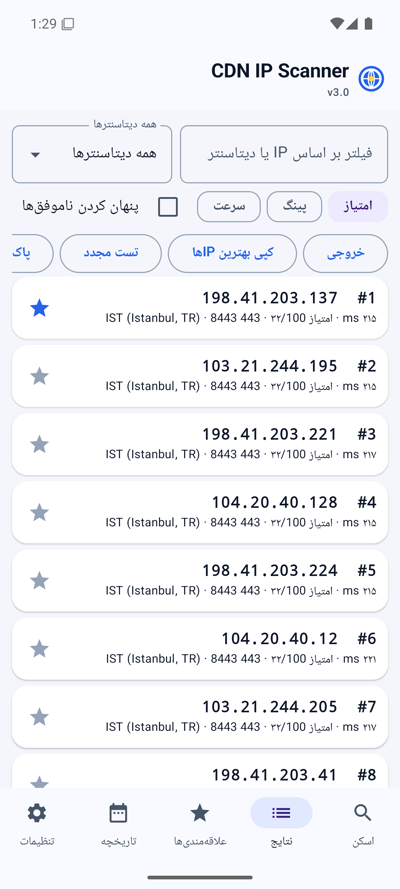 | 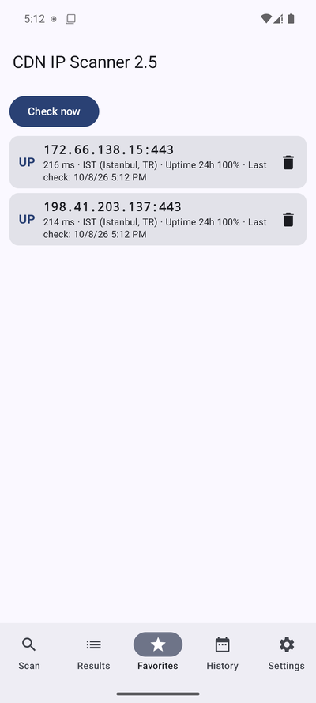 | 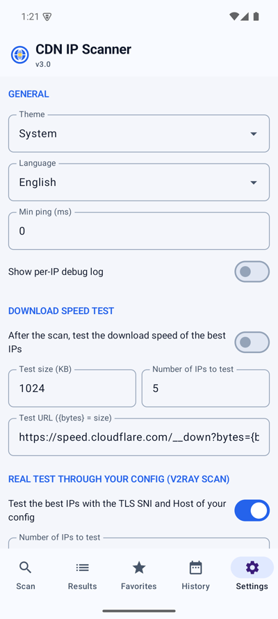 |

<div dir="rtl">

همان اسکنر نسخه وب (پیش‌چک TCP، تأیید ۵ باره `/cdn-cgi/trace`، امتیازدهی)، منابع رنج، کانفیگ V2Ray با جایگزینی آی‌پی، لینک ساب‌اسکریپشن، QR، خروجی Clash / sing-box، تست سرعت دانلود، علاقه‌مندی‌ها با پایش پس‌زمینه و هشدار تلگرام، تاریخچه اسکن، تست مجدد، اشتراک TXT/JSON/CSV و چهار زبان. اسکن در یک سرویس پیش‌زمینه اجرا می‌شود و با خاموش شدن صفحه قطع نمی‌شود.

---

## 🛠 برای توسعه‌دهندگان

</div>

```bash
# اپ npm (Node.js 18+)
cd node
npm install
npm start -- --port 8080          # یا: node bin/cli.js --port 8080
npm test                          # تست‌های node:test

# سرور پایتون (نسخه سرور لینوکس، همان رابط)
python3 -m venv venv && source venv/bin/activate
pip install -r requirements.txt
python run.py --port 8080
python -m pytest

# اپ اندروید (JDK 17 + Android SDK)
cd android
./gradlew assembleDebug testDebugUnitTest
```

<div dir="rtl">

اپ npm و سرور پایتون پوشه‌های `app/static` و `app/templates` را مشترک استفاده می‌کنند. جدول متغیرهای محیطی، ساختار پروژه، Tech Stack و راهنمای امضای APK (سکرت‌های `ANDROID_KEYSTORE_*`) و انتشار npm (Trusted Publishing یا `NPM_TOKEN`) در [README انگلیسی](README.md#-for-developers) و [CONTRIBUTING.md](CONTRIBUTING.md) آمده است.

---

## 🆕 تغییرات نسخه ۳.۰

- **اپ npm جایگزین نسخه‌های دسکتاپ شد.** با `npm install -g cdn-ip-scanner` کل اسکنر روی ویندوز، مک و لینوکس نصب می‌شود و با `cdn-ip-scanner --port <port>` روی پورت دلخواه بالا می‌آید. این یک پورت کامل سرور به Node.js (Express + Socket.IO) است با دقیقاً همان امکانات: هر سه روش اسکن، تست واقعی Xray، تست سرعت، پایش علاقه‌مندی‌ها با تلگرام، ادامه اسکن، تست مجدد، خروجی‌ها (JSON / اکسل / CSV / TXT)، Clash و sing-box، QR، ساب‌اسکریپشن، گزارش عیب‌یابی، چهار زبان و به‌روزرسانی خودکار. داده‌ها به صورت JSON در `~/.cdn-ip-scanner` ذخیره می‌شوند؛ بدون ماژول نیتیو و بدون نیاز به کامپایلر.
- **قالب جدید رابط وب.** چیدمان داشبوردی، پالت‌های بازطراحی‌شده روشن و تاریک، کاشی‌های آمار، دکمه‌های گرد، هدر شفاف چسبان، جدول‌ها و مودال‌های بهتر و اصلاح راست‌چین. تم ذخیره‌شده از سمت سرور اعمال می‌شود تا هنگام باز شدن صفحه تم اشتباه نمایش داده نشود.
- **قالب جدید اندروید.** پالت Material 3 (آبی / بنفش / سبز)، نوار بالای برنددار، کاشی‌های آمار در کارت اسکن، کارت‌های نتیجه برجسته، نشان‌های وضعیت (UP / DOWN / مرده)، عنوان بخش‌ها و نوار پیشرفت مدرن، در حالت روشن و تاریک.
- **خط انتشار.** هر تگ، پکیج npm، فایل APK اندروید و `SHA256SUMS.txt` را منتشر می‌کند و از طریق Trusted Publishing (یا سکرت `NPM_TOKEN` در صورت وجود) روی npmjs.com هم منتشر می‌شود. CI تست‌های Node را روی لینوکس، ویندوز و مک با Node 18 و 22، تست‌های پایتون و بیلد و تست اندروید را اجرا می‌کند.
- **رفع اشکال.** کد دیتاسنترهای Fastly دیگر شماره نود کش را شامل نمی‌شود (`SOF1510038` ← `SOF`)؛ اپ اندروید بعد از باز شدن دوباره، نتایج آخرین اسکن را بازیابی می‌کند.
- **حذف شده.** بیلدهای PyInstaller برای exe / app / tar لینوکس. به جای آن از اپ npm استفاده کنید؛ سرور پایتون و `install.sh` برای سرورهای لینوکس باقی می‌مانند.

تاریخچه کامل: [CHANGELOG.md](CHANGELOG.md)

---

## 🎬 آموزش تصویری

آموزش کامل نصب و استفاده از برنامه را در یوتیوب ببینید: **📺 [مشاهده در یوتیوب](https://youtu.be/S8H9AMVfz6M)**

---

## 🤝 مشارکت

از مشارکت شما استقبال می‌کنیم! ابتدا **[CONTRIBUTING.md](CONTRIBUTING.md)** را بخوانید. برای گزارش باگ، گزارش **⚙️ تنظیمات ← عیب‌یابی ← دانلود گزارش** را به ایشو پیوست کنید.

---

## 💰 حمایت مالی

اگر این پروژه برای شما مفید بود، می‌توانید از طریق ارسال USDT از توسعه‌دهنده حمایت کنید.

**USDT (TRC20) — شبکه ترون**

</div>

```
TB3aXqkMioddzcgtqPfeBFthYUY9tj9kbs
```

<div dir="rtl">

**USDT (ERC20) — شبکه اتریوم**

</div>

```
0xd907642587cd654830F9C7bcc8084c8dF5B82713
```

<div dir="rtl">

> از حمایت شما سپاسگزاریم! هر کمکی به ادامه حیات و نگهداری این پروژه کمک می‌کند. 🙏

---

## 📄 مجوز

این پروژه متن‌باز است و تحت [مجوز MIT](LICENSE) منتشر می‌شود.

---

## 👨‍💻 نویسنده

**shahinst**

- گیت‌هاب: [@shahinst](https://github.com/shahinst)
- یوتیوب: [@shaahinst](https://www.youtube.com/@shaahinst)
- وب‌سایت: [digicloud.tr](https://digicloud.tr)

---

<p align="center"><b>اگر این پروژه برای شما مفید بود، لطفاً یک ⭐ در گیت‌هاب بدهید!</b></p>

</div>
