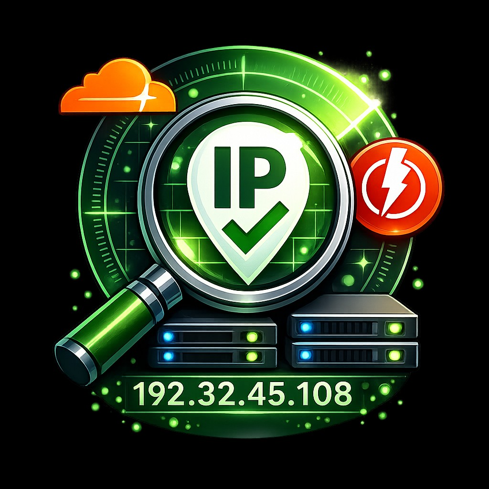
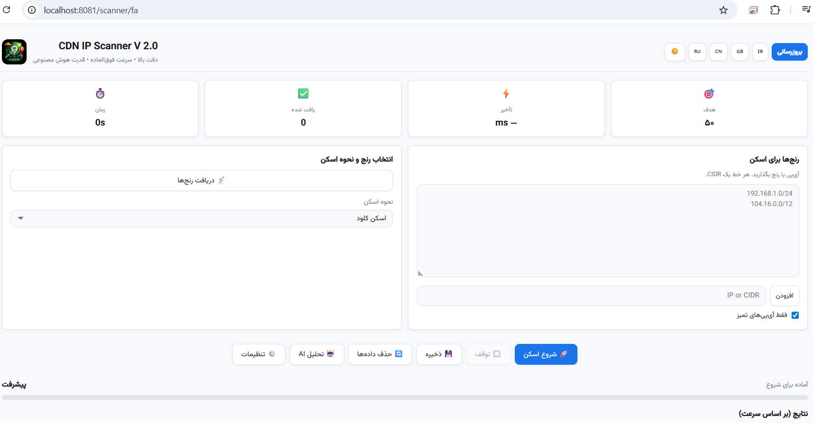

<p align="center">
  
</p>

<h1 align="center">CDN IP Scanner V2.0</h1>

<p align="center">
  <b>High Accuracy &bull; Ultra Fast &bull; AI Powered</b>
</p>

<p align="center">
  <a href="https://github.com/shahinst/cdn-ip-scanner/releases"></a>
  <a href="https://github.com/shahinst/cdn-ip-scanner/stargazers"></a>
  <a href="https://github.com/shahinst/cdn-ip-scanner/blob/main/LICENSE"></a>
  <a href="https://github.com/shahinst/cdn-ip-scanner/releases"></a>
</p>

<p align="center">
  <a href="#-english">English</a> &bull;
  <a href="#-فارسی">فارسی</a> &bull;
  <a href="#-download--دانلود">Download</a> &bull;
  <a href="#-donate--حمایت-مالی">Donate</a>
</p>

---

<p align="center">
  
</p>

---

## 🇬🇧 English

### What is CDN IP Scanner?

**CDN IP Scanner** is a powerful, web-based tool for scanning and finding the fastest CDN (Content Delivery Network) IP addresses. It helps users discover clean, low-latency IPs from providers like **Cloudflare**, **Fastly**, and other CDN networks.

The scanner uses a proven **5-attempt verification method** with `/cdn-cgi/trace` endpoint checking, ensuring only genuinely responsive IPs are reported. Combined with AI-powered optimization and multi-threaded scanning, it delivers results faster and more accurately than any other tool.

### Key Features

| Feature | Description |
|---------|-------------|
| **Multi-Source Range Fetching** | Fetch CDN IP ranges from Cloudflare API, ASN, GitHub, Fastly, and vfarid verified list |
| **5-Attempt Verification** | Each IP is tested 5 times with connection reuse — minimum 3/5 success required |
| **Real-Time Results** | Results appear instantly via WebSocket as each IP is found |
| **Operator Detection** | Test CDN IPs against Iranian (Irancell, MCI, Rightel, Shuttle), Chinese, and Russian operators |
| **V2Ray Config Support** | Parse and test vless://, vmess://, trojan:// configs with automatic IP replacement |
| **4 Speed Modes** | Hyper (20%), Turbo (40%), Ultra (60%), Deep (80%) — control resource usage |
| **AI Optimization** | Smart IP sampling and range prioritization for faster discovery |
| **Multi-Language** | Full support for English, فارسی (Persian), 中文 (Chinese), Русский (Russian) |
| **Dark/Light Theme** | Beautiful modern UI with dark mode support |
| **Export Results** | Save results as JSON, Excel (.xlsx), or Text (IPs only) |
| **Ping & Port Filtering** | Filter results by ping range and specific open ports |
| **Auto-Update** | Check for updates and install directly from the app |
| **Scan Logging** | Real-time scan log with DEBUG mode for troubleshooting |
| **Stop Anytime** | Responsive stop button that halts scanning within 2 seconds |

### How It Works

```
1. Fetch CDN IP ranges (or paste your own)
2. Select scan method (Cloud / Operator / V2Ray)
3. Configure target count, ping range, ports
4. Click "Start Scan"
5. Watch results appear in real-time
6. Export or copy the best IPs
```

### Scan Methods

- **Cloud Scan** — Direct CDN IP scanning with TCP pre-filter + 5-attempt HTTP verification
- **Operator Scan** — Test which CDN IPs work best on your specific ISP/operator
- **V2Ray Scan** — Paste a V2Ray config and find working IPs for it automatically

### System Requirements

| Platform | Requirement |
|----------|-------------|
| **Windows** | Windows 10/11 (64-bit) — No installation needed |
| **Linux** | Ubuntu 20/22/24, Debian 10+, CentOS 7+, RHEL, Rocky, Alma, Fedora |
| **macOS** | macOS 11+ (Big Sur, Monterey, Ventura, Sonoma, Sequoia) |

---

## 📥 Download / دانلود

You can download pre-built versions for all platforms from the **Releases** page:

### **[⬇️ Download from Releases](https://github.com/shahinst/cdn-ip-scanner/releases)**

| Platform | File | Description |
|----------|------|-------------|
| **Windows** | `CDN-IP-Scanner-Windows.zip` | Standalone .exe — just extract and run, no Python needed |
| **Linux** | `CDN-IP-Scanner-Linux.tar.gz` | Full source + smart installer script |
| **macOS** | `CDN-IP-Scanner-macOS.zip` | Build kit — run `build.sh` on Mac to create .app |
| **Source** | `Source code (zip/tar.gz)` | Original source code for developers |

---

## 🐧 Install on Linux (from Source)

The source code on GitHub is designed for Linux server deployment. Follow these steps:

### Quick Install (One Command)

```bash
# Clone the repository
git clone https://github.com/shahinst/cdn-ip-scanner.git

# Enter the directory
cd cdn-ip-scanner

# Run the smart installer
sudo bash install.sh
```

### What the Installer Does

The installer is fully interactive and will:

1. **Detect your OS** — Ubuntu, Debian, CentOS, RHEL, Rocky, Alma, Fedora
2. **Ask for panel credentials** — Username & password for web access
3. **Ask for hostname** — Domain name or server IP
4. **Install all dependencies** — Python, Nginx, SSL, and all packages
5. **Setup SSL** — Let's Encrypt for domains, self-signed for IPs
6. **Configure Nginx** — Reverse proxy with Basic Auth protection
7. **Create systemd service** — Auto-start on boot
8. **Configure firewall** — Open ports 80 and 443
9. **Show access details** — URL, username, password

### After Installation

```bash
# Check status
systemctl status cdn-ip-scanner

# View logs
journalctl -u cdn-ip-scanner -f

# Restart
systemctl restart cdn-ip-scanner

# Uninstall
bash /opt/cdn-ip-scanner/uninstall.sh
```

### Manual Installation (Advanced)

```bash
git clone https://github.com/shahinst/cdn-ip-scanner.git
cd cdn-ip-scanner
python3 -m venv venv
source venv/bin/activate
pip install -r requirements.txt
python run.py --port 8080
```

---

## 🎬 Video Tutorial

Watch the full installation and usage tutorial on YouTube:

### **[📺 Watch on YouTube](https://www.youtube.com/@shaahinst)**

---

## 🇮🇷 فارسی

### CDN IP Scanner چیست؟

**CDN IP Scanner** یک ابزار قدرتمند و تحت وب برای اسکن و پیدا کردن سریع‌ترین آی‌پی‌های CDN (شبکه توزیع محتوا) است. این ابزار به کاربران کمک می‌کند تا آی‌پی‌های تمیز و با تأخیر پایین از ارائه‌دهندگانی مانند **Cloudflare**، **Fastly** و سایر شبکه‌های CDN را پیدا کنند.

اسکنر از یک روش **تأیید ۵ مرحله‌ای** اثبات‌شده با بررسی endpoint مسیر `/cdn-cgi/trace` استفاده می‌کند و فقط آی‌پی‌هایی که واقعاً پاسخ‌گو هستند را گزارش می‌دهد. همراه با بهینه‌سازی هوش مصنوعی و اسکن چندنخی، نتایج را سریع‌تر و دقیق‌تر از هر ابزار دیگری ارائه می‌دهد.

### ویژگی‌های کلیدی

| ویژگی | توضیحات |
|-------|---------|
| **دریافت رنج از چندین منبع** | دریافت رنج آی‌پی CDN از API کلودفلر، ASN، گیت‌هاب، فستلی و لیست تأیید‌شده vfarid |
| **تأیید ۵ مرحله‌ای** | هر آی‌پی ۵ بار با استفاده مجدد از اتصال تست می‌شود — حداقل ۳ از ۵ موفقیت لازم است |
| **نتایج لحظه‌ای** | نتایج از طریق WebSocket بلافاصله پس از پیدا شدن هر آی‌پی نمایش داده می‌شود |
| **تشخیص اپراتور** | تست آی‌پی‌های CDN روی اپراتورهای ایرانی (ایرانسل، همراه اول، رایتل، شاتل)، چینی و روسی |
| **پشتیبانی V2Ray** | پارس و تست کانفیگ‌های vless://، vmess://، trojan:// با جایگزینی خودکار آی‌پی |
| **۴ حالت سرعت** | هایپر (۲۰%)، توربو (۴۰%)، اولترا (۶۰%)، دیپ (۸۰%) — کنترل مصرف منابع |
| **بهینه‌سازی هوش مصنوعی** | نمونه‌برداری هوشمند و اولویت‌بندی رنج برای کشف سریع‌تر |
| **چندزبانه** | پشتیبانی کامل از فارسی، English، 中文، Русский |
| **تم تاریک/روشن** | رابط کاربری مدرن و زیبا با پشتیبانی حالت تاریک |
| **خروجی نتایج** | ذخیره نتایج به صورت JSON، اکسل (xlsx.) یا متن (فقط آی‌پی) |
| **فیلتر پینگ و پورت** | فیلتر نتایج بر اساس محدوده پینگ و پورت‌های باز خاص |
| **بروزرسانی خودکار** | بررسی و نصب بروزرسانی مستقیم از داخل برنامه |
| **لاگ اسکن** | لاگ لحظه‌ای اسکن با حالت DEBUG برای عیب‌یابی |
| **توقف فوری** | دکمه توقف که اسکن را ظرف ۲ ثانیه متوقف می‌کند |

### نحوه کار

<div dir="rtl">

```
۱. دریافت رنج آی‌پی‌های CDN (یا قرار دادن دستی)
۲. انتخاب روش اسکن (کلود / اپراتور / V2Ray)
۳. تنظیم تعداد هدف، محدوده پینگ، پورت‌ها
۴. کلیک روی "شروع اسکن"
۵. مشاهده نتایج به صورت لحظه‌ای
۶. خروجی گرفتن یا کپی بهترین آی‌پی‌ها
```

</div>

### روش‌های اسکن

<div dir="rtl">

- **اسکن کلود** — اسکن مستقیم آی‌پی CDN با پیش‌فیلتر TCP و تأیید HTTP پنج‌مرحله‌ای
- **اسکن اپراتور** — بررسی اینکه کدام آی‌پی‌های CDN روی اپراتور شما بهتر کار می‌کنند
- **اسکن V2Ray** — کانفیگ V2Ray خود را قرار دهید و آی‌پی‌های فعال را به صورت خودکار پیدا کنید

</div>

---

## 📥 دانلود

نسخه‌های آماده برای همه پلتفرم‌ها از صفحه **Releases** قابل دانلود هستند:

### **[⬇️ دانلود از Releases](https://github.com/shahinst/cdn-ip-scanner/releases)**

<div dir="rtl">

| پلتفرم | فایل | توضیحات |
|--------|------|---------|
| **ویندوز** | `CDN-IP-Scanner-Windows.zip` | فایل exe مستقل — فقط استخراج و اجرا کنید، نیاز به پایتون نیست |
| **لینوکس** | `CDN-IP-Scanner-Linux.tar.gz` | سورس کامل + اسکریپت نصب هوشمند |
| **مک** | `CDN-IP-Scanner-macOS.zip` | کیت ساخت — فایل build.sh را روی مک اجرا کنید |
| **سورس** | `Source code (zip/tar.gz)` | کد منبع اصلی برای توسعه‌دهندگان |

</div>

---

## 🐧 نصب روی لینوکس (از سورس)

کد منبع موجود در گیت‌هاب برای استقرار روی سرور لینوکس طراحی شده است:

### نصب سریع (یک دستور)

```bash
# کلون مخزن
git clone https://github.com/shahinst/cdn-ip-scanner.git

# ورود به دایرکتوری
cd cdn-ip-scanner

# اجرای نصب‌کننده هوشمند
sudo bash install.sh
```

### نصب‌کننده چه کارهایی انجام می‌دهد

<div dir="rtl">

نصب‌کننده کاملاً تعاملی است و:

۱. **سیستم‌عامل شما را تشخیص می‌دهد** — اوبونتو، دبیان، سنت‌اواس، RHEL، راکی، آلما، فدورا
۲. **اطلاعات ورود پنل را می‌پرسد** — نام کاربری و رمز عبور
۳. **آدرس هاست را می‌پرسد** — نام دامنه یا آی‌پی سرور
۴. **همه وابستگی‌ها را نصب می‌کند** — پایتون، انجین‌ایکس، SSL و همه پکیج‌ها
۵. **SSL را نصب می‌کند** — Let's Encrypt برای دامنه، self-signed برای آی‌پی
۶. **انجین‌ایکس را پیکربندی می‌کند** — ریورس پراکسی با محافظت Basic Auth
۷. **سرویس systemd می‌سازد** — شروع خودکار هنگام بوت
۸. **فایروال را تنظیم می‌کند** — باز کردن پورت‌های ۸۰ و ۴۴۳
۹. **اطلاعات دسترسی را نمایش می‌دهد** — آدرس، نام کاربری، رمز عبور

</div>

### پس از نصب

```bash
# بررسی وضعیت
systemctl status cdn-ip-scanner

# مشاهده لاگ
journalctl -u cdn-ip-scanner -f

# ریستارت
systemctl restart cdn-ip-scanner

# حذف
bash /opt/cdn-ip-scanner/uninstall.sh
```

---

## 🎬 آموزش تصویری

آموزش کامل نصب و استفاده از برنامه را در یوتیوب ببینید:

### **[📺 مشاهده در یوتیوب](https://www.youtube.com/@shaahinst)**

---

## 🛠 Tech Stack

| Component | Technology |
|-----------|-----------|
| **Backend** | Python 3, Flask, Flask-SocketIO, gevent |
| **Frontend** | Vanilla JS, CSS3 (custom design) |
| **Database** | SQLite (default) / MySQL / MariaDB |
| **WebSocket** | Socket.IO (real-time results) |
| **Web Server** | Nginx (reverse proxy) |
| **Scanning** | ThreadPoolExecutor, /cdn-cgi/trace verification |
| **Export** | openpyxl (Excel), JSON, Plain Text |

---

## 📁 Project Structure

```
cdn-ip-scanner/
├── run.py                  # Application entry point
├── install.sh              # Smart Linux installer
├── requirements.txt        # Python dependencies
├── version                 # Version file
└── app/
    ├── __init__.py         # Flask app factory
    ├── config.py           # Configuration
    ├── models.py           # Database models
    ├── routes/
    │   ├── api.py          # REST API + scan logic
    │   └── main.py         # Page routes
    ├── scanner/
    │   ├── core.py         # Scan engine (5-attempt verification)
    │   ├── range_fetcher.py # CDN range fetcher (multi-source)
    │   ├── operators.py    # ISP operator definitions & fetch
    │   ├── v2ray.py        # V2Ray config parser & scanner
    │   └── ai_optimizer.py # AI-powered range optimization
    ├── static/
    │   ├── css/style.css   # Modern responsive design
    │   ├── js/app.js       # Frontend application
    │   ├── font/           # Vazirmatn (Persian) + FontAwesome
    │   └── img/logo.png    # Application logo
    └── templates/
        ├── base.html       # Base template
        ├── index.html      # Language selection page
        └── scanner.html    # Main scanner interface
```

---

## 🤝 Contributing

Contributions are welcome! Please feel free to submit a Pull Request.

1. Fork the repository
2. Create your feature branch (`git checkout -b feature/amazing`)
3. Commit your changes (`git commit -m 'Add amazing feature'`)
4. Push to the branch (`git push origin feature/amazing`)
5. Open a Pull Request

---

## 💰 Donate / حمایت مالی

<div dir="rtl">

اگر این پروژه برای شما مفید بود، می‌توانید از طریق ارسال USDT از توسعه‌دهنده حمایت کنید.

</div>

If this project is useful to you, you can support the developer by sending USDT:

### USDT (TRC20) — Tron Network
```
TB3aXqkMioddzcgtqPfeBFthYUY9tj9kbs
```

### USDT (ERC20) — Ethereum Network
```
0xd907642587cd654830F9C7bcc8084c8dF5B82713
```

> Thank you for your support! Every donation helps keep this project alive and maintained. 🙏
>
> <div dir="rtl">از حمایت شما سپاسگزاریم! هر کمکی به ادامه حیات و نگهداری این پروژه کمک می‌کند. 🙏</div>

---

## 📄 License

This project is open source and available under the [MIT License](LICENSE).

---

## 👨‍💻 Author

**shahinst**

- GitHub: [@shahinst](https://github.com/shahinst)
- YouTube: [@shaahinst](https://www.youtube.com/@shaahinst)
- Website: [digicloud.tr](https://digicloud.tr)

---

<p align="center">
  <b>If you find this project useful, please give it a ⭐ on GitHub!</b>
  <br>
  <div align="center" dir="rtl"><b>اگر این پروژه برای شما مفید بود، لطفاً یک ⭐ در گیت‌هاب بدهید!</b></div>
</p>
